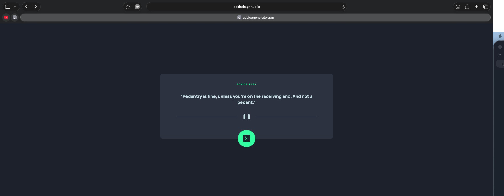
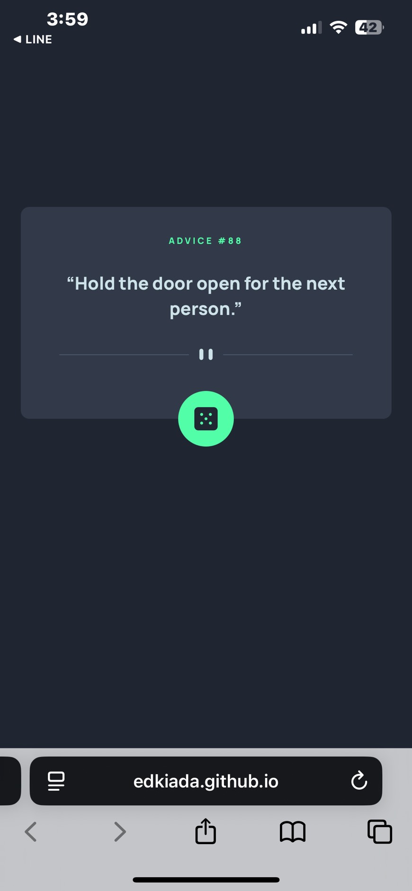

# Frontend Mentor - Advice generator app solution

## Overview

### The challenge

Users should be able to:

- View the optimal layout for the app depending on their device's screen size
- See hover states for all interactive elements on the page
- Generate a new piece of advice by clicking the dice icon

### Screenshot

#### Desktop Version

#### Mobile Version

### Links

- [Source Code](https://github.com/edkiada/AdviceGeneratorApp)
- [Live Demo](https://edkiada.github.io/AdviceGeneratorApp/)

## My process

### Built with

- Semantic HTML5 markup
- CSS custom properties
- Flexbox
- Mobile-first workflow
- [vue 3](https://vuejs.org/) - Reactive components via Composition API.
- [Vite](https://nextjs.org/) - Fast frontend build tool.
- [Manrope Font](https://fonts.google.com/specimen/Manrope) - Enhanced typing readability.

### What I learned

Use `fetch` to get data from the API.

### Continued development

Error Handling, Loading States and Search/filter.

### Useful resources

- [Vue 3 Docs](https://vuejs.org/) - Crucial for understanding the Composition API and reactive state.
- [MDN CSS Selectors](https://developer.mozilla.org/en-US/docs/Web/CSS/CSS_Selectors) - Helped in styling custom components and handling pseudo-classes.

### AI Collaboration

-Gemini: Teach me how to use the function of fetch and async.

## Author

- GitHub - [@edkiada](https://github.com/edkiada)
- Frontend Mentor - [@edkiada](https://www.frontendmentor.io/profile/edkiada)
- Email - [yyh901277111@gmail.com](mailto:yyh901277111@gmail.com)

## Acknowledgments

- [Frontend Mentor](https://www.frontendmentor.io) - For providing the professional design files and the challenging project requirements.